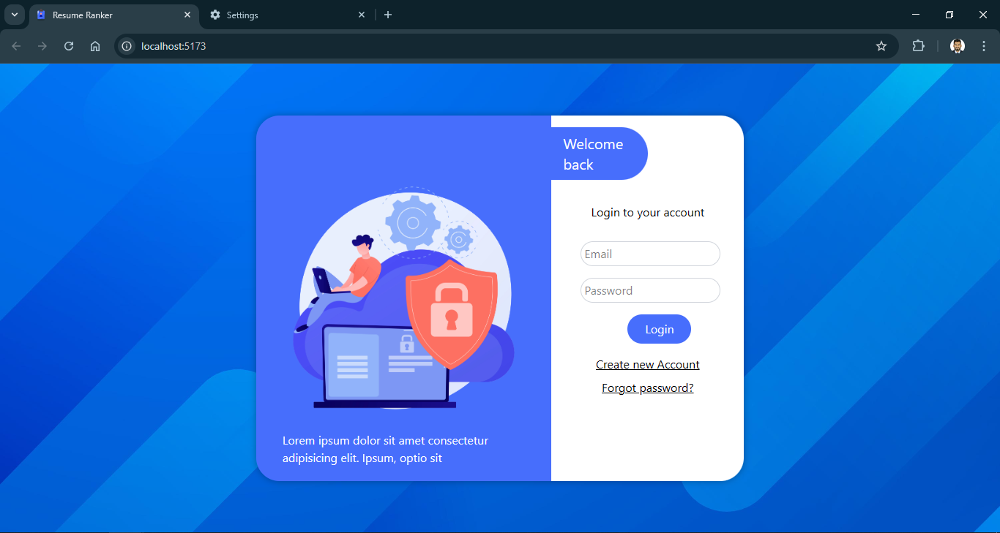
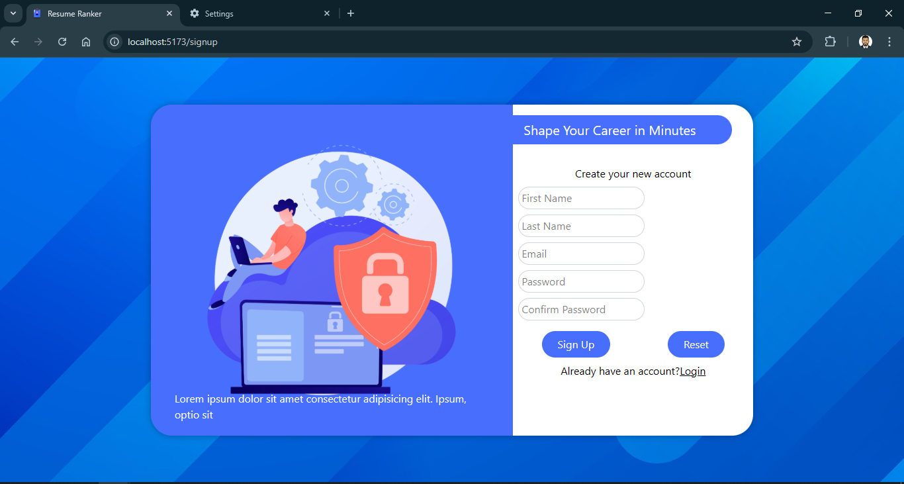
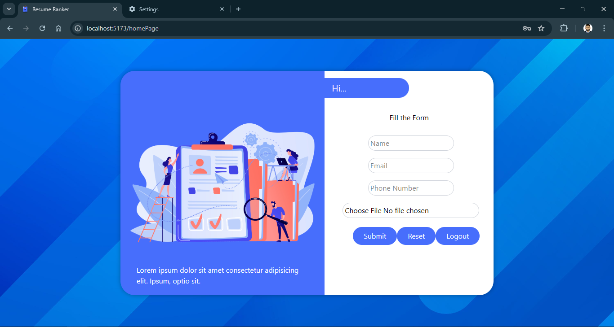
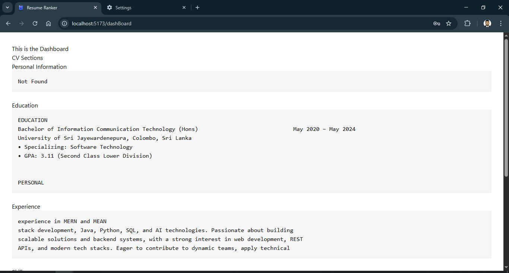

# 📄 Resume Ranker Web App

A **full-stack web application** for reading, categorizing, and managing resumes. The app allows users to **sign up, log in, upload resumes (PDF)**, and view categorized results on a **dashboard**. Built with a **React + Vite frontend** and **Express.js + MongoDB backend**.

---

## 🚀 Features

* 🔑 **Authentication & Authorization** (JWT-based login/signup)
* 📂 **Upload resumes (PDF)** with parsing support
* 🧠 **Categorization engine** for sorting resumes
* 📊 **Interactive dashboard** to view/manage categorized resumes
* ⚡ **Responsive UI** with React + TailwindCSS

---

## 🛠️ Tech Stack

**Frontend (Client)**

* React 19 + Vite
* TailwindCSS
* Axios
* React Router DOM
* React Hot Toast (notifications)

**Backend (Server)**

* Node.js + Express.js
* MongoDB + Mongoose
* JWT Authentication
* Multer (file uploads)
* PDF-Parse (resume parsing)
* Bcrypt (password hashing)

---

## 📂 Project Structure

```bash
root/
│── client/        # React + Vite frontend
│── server/        # Express.js backend
│── README.md      # Project documentation
```

---

## ⚙️ Installation & Setup

### 1️⃣ Clone the repository

```bash
git clone https://github.com/your-username/resume-ranker.git
cd resume-ranker
```

### 2️⃣ Setup the Backend (Server)

```bash
cd server
npm install
npm run devStart   # start server with nodemon
```

Create a `.env` file in the `server` directory:

```env
PORT=5000
MONGO_URI=your_mongodb_connection_string
JWT_SECRET=your_jwt_secret
```

### 3️⃣ Setup the Frontend (Client)

```bash
cd ../client
npm install
npm run dev        # start Vite dev server
```

The app should now be running on:

* Frontend: `http://localhost:5173`
* Backend: `http://localhost:5000`

---

## 📸 Screenshots

*Add your screenshots here (stored in `/assets/screenshots/`).*

**Login Page**



**Sign Up Page**



**Dashboard**


**CV data**

---

## 📌 Future Improvements

* 🤖 Integrate AI/ML for smarter resume ranking
* 📑 Export categorized resumes as reports
* 🌐 Deploy with Docker/CI-CD pipelines

---

## 👨‍💻 Author

**Priyanjan Perera**
🚀 Software Engineer

---

## 📜 License

This project is licensed under the **ISC License**.
